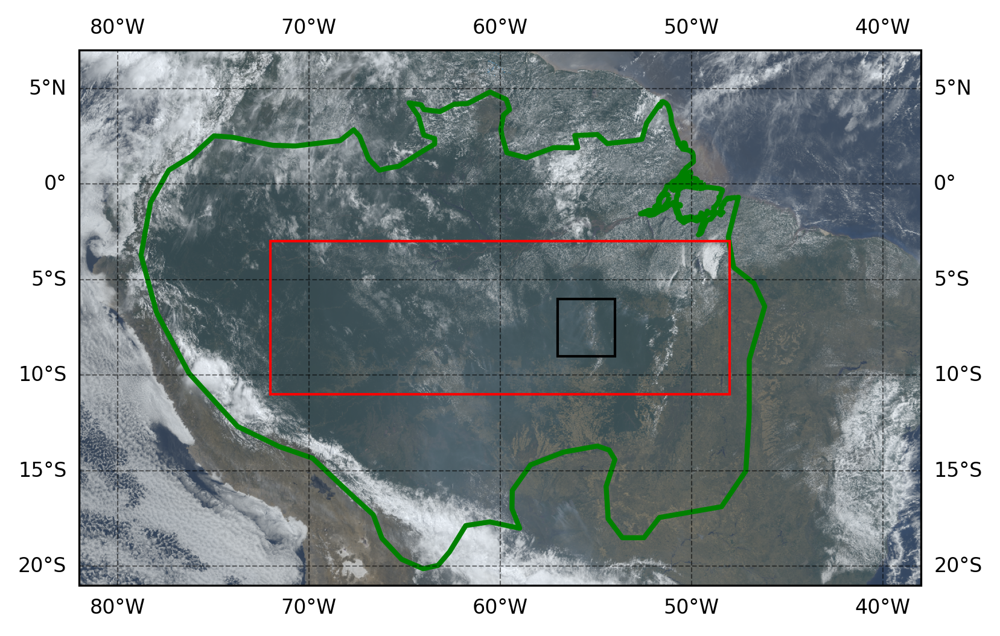
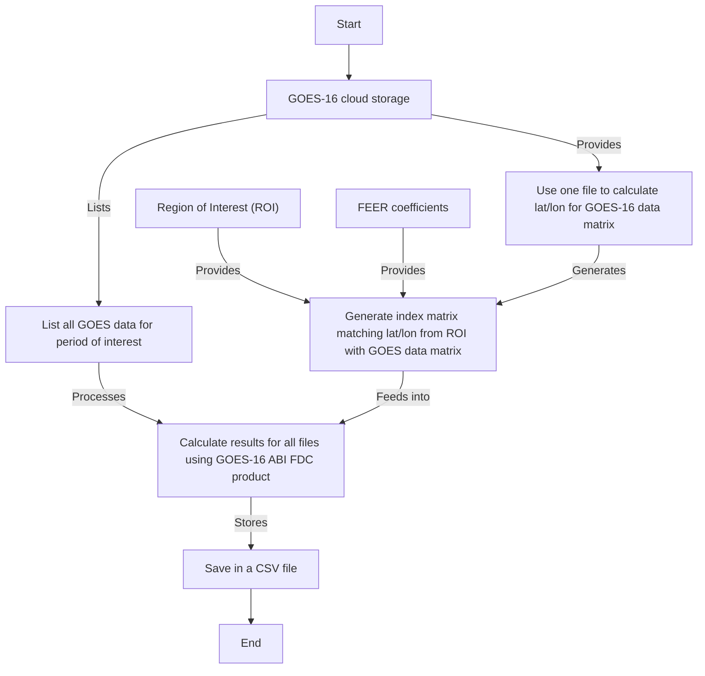

# Particulate and Gas Emissions from Wildfires in the Southern Amazon (2020-2022)

[](https://github.com/thiago-vg/GOES-Fire-Inventory/issues)
[](https://github.com/thiago-vg/GOES-Fire-Inventory/releases)


This repository contains the scripts associated with the article:

**"Particulate and gas emissions from wildfires in the southern Amazon, from 2020 to 2022, from GOES-16 fire radiative power retrievals."**

## Overview
These scripts are designed to analyze particulate and gas emissions from wildfires in the southern Amazon using fire radiative power (FRP) data from the GOES-16 satellite. The computations rely on the Pangeo open science community's Docker image, ensuring a reproducible and scalable workflow.

### Example Output
Below is an example image generated by one of the scripts:



## Prerequisites
To run these scripts, you need to use the **Pangeo-notebook** Docker image:

[](https://hub.docker.com/r/pangeo/pangeo-notebook)  
[](https://www.pangeo.io/)

Ensure you have **Docker** installed on your system before proceeding.

## Installation and Setup

1. **Pull the Pangeo Docker Image**:
   ```sh
   docker pull pangeo/pangeo-notebook:latest
   ```

2. **Run the Docker Container**:
   ```sh
   docker run -p 8888:8888 -v $(pwd):/home/jovyan/work --rm pangeo/pangeo-notebook
   ```
   This will start a Jupyter Notebook server that can be accessed at `http://localhost:8888/`.

3. **Clone this Repository**:
   ```sh
   git clone https://github.com/thiago-vg/Teste_Repo.git
   cd Teste_Repo
   ```

4. **Open JupyterLab and Start Working**
   - Navigate to `http://localhost:8888/`
   - Open the scripts within the `work` directory in JupyterLab.

## Scripts and Usage
Scripts prefixed with "Get" access GOES-16 data directly from the internet, so downloading the data is not necessary beforehand. However, if the connection is slow or the analysis needs to be repeated multiple times, it is recommended to download the data locally. A script is provided to assist with this process.

Preprocessed GOES-16 data used in the article is available in the following Google Drive directory:

[](https://drive.google.com/drive/folders/1W61s7nVHnFUXPmcWT-ygnxPznFd-3ama?usp=sharing)

Additional datasets used in the analysis can be accessed from their respective sources:

- **GFED:** [Global Fire Emissions Database](https://www.globalfiredata.org/data.html)
- **FEER:** [Fire Energetics and Emissions Research Database](https://feer.gsfc.nasa.gov/data/emissions/)
- **GFAS:** [Global Fire Assimilation System](https://ads.atmosphere.copernicus.eu/datasets/cams-global-fire-emissions-gfas?tab=download)

Once the data is available, additional scripts are provided for further processing, analysis, and visualization.

Some of the generated maps require the use of shapefiles, all of which are included in the "Auxiliary data" directory.

- The shapefile for the **Amazon Basin** is sourced from: [](https://cartographyvectors.com/map/1255-amazon-basin)
- The shapefiles for **roads and cities** come from the **Natural Earth** database: [](https://www.naturalearthdata.com/)

Additionally, the mapping of land use, available in the script **"Plot_landuse.ipynb"**, utilizes the dataset from:

[](https://www.earthdata.nasa.gov/data/catalog?keyword=MCD12C1)

The flowchart below streamlines the process for the **"Get"** scripts. While the other scripts are more straightforward, these are fundamental to understanding the process of obtaining the results presented in the article.  




## Citation
If you use these scripts in your research, please cite our article:
> **Particulate and Gas Emissions from Wildfires in the Southern Amazon, from 2020 to 2022, from GOES-16 Fire Radiative Power Retrievals**
Thiago Ferreira da Nobrega and Alexandre Lima Correia
ACS ES&T Air Article ASAP
DOI: 10.1021/acsestair.4c00209

Or cite the repository:
[](https://doi.org/10.5281/zenodo.14849712)

## Contact
For questions or contributions, feel free to reach out via GitHub issues or email.

---
